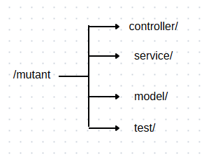
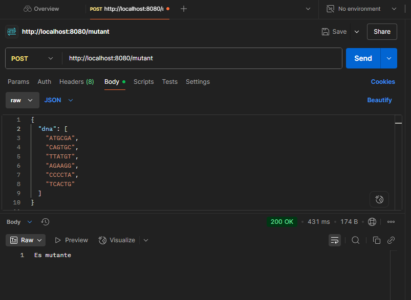
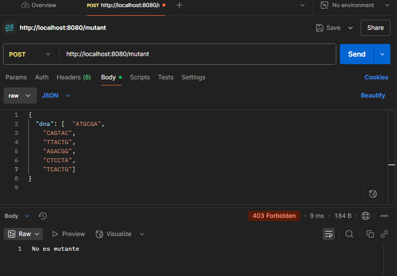
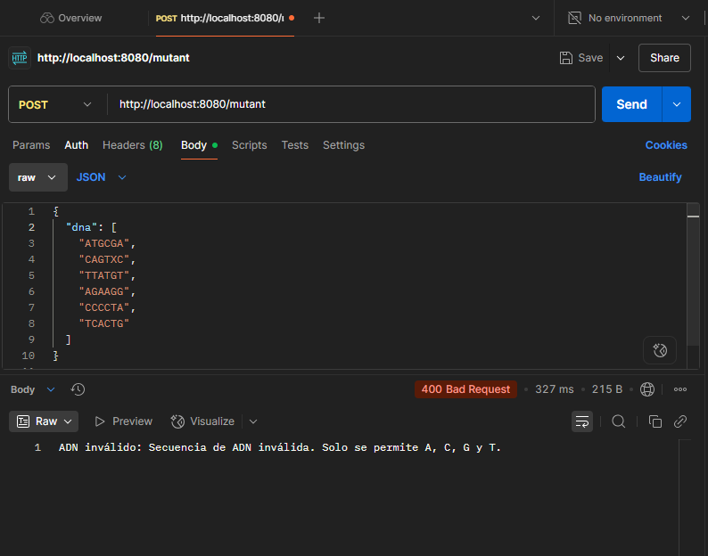

# Mutant Detector API

Este proyecto es una API REST desarrollada en Java con Spring Boot para identificar si una secuencia de ADN pertenece a un mutante.

**Enunciado del Reto**

La API de magneto debe analizar una matriz de ADN NxN y detectar si contiene al menos dos secuencias de cuatro letras iguales de forma horizontal, vertical o diagonal.  
Si se detecta, se considerará un mutante.

**Notas**

- Se valida que los caracteres sean solo A, T, C, G.

- Las secuencias son detectadas en 4 direcciones: derecha, abajo, diagonal derecha, diagonal izquierda.

- El nivel 3 (estadísticas y persistencia en base de datos) no fue implementado aún.

**Tecnologías utilizadas**

- Java 17
- Spring Boot
- Maven
- JUnit 
- JSON (entrada/salida)
- Postman 

**Estructura del proyecto**

**Cómo ejecutar el proyecto**

Clona el repositorio:

git clone https://github.com/Canorjuela/MutantDetectorApi.git

Ingresa al directorio del proyecto y ejecuta el proyecto con Maven:

mvn spring-boot:run

Prueba la API con:

POST http://localhost:8080/mutant

**Ejemplo de petición (Postman)**

{
  "adn": ["ATGCGA", "CAGTGC", "TTATGT", "AGAAGG", "CCCCTA", "TCACTG"]
}

200 OK = Es mutante

403 Forbidden = No es mutante

400	= ADN inválido (excepción)

**Pruebas**

Puedes ejecutar las pruebas unitarias con:

mvn test

Se incluyen pruebas para:

- Casos positivos (ADN mutante)

- Casos negativos (ADN no mutante)

- Excepciones por caracteres inválidos

  **Capturas de Pantalla**
  
Es Mutante

No es Mutante

ADN Invalido

Camila Orjuela Estudiante de Ingeniería de Software | Desarrolladora Backend en formación 

  

